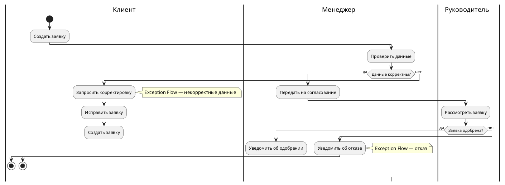

# BPMN-диаграммы — справочник элементов и синтаксиса

## Поддержка инструментов

| Инструмент | Pools | Lanes | Типы событий | Шлюзы | Ограничение |
|-----------|-------|-------|-------------|-------|-------------|
| **PlantUML** (swimlane activity) | ✗ | ✅ через `\|Lane\|` | Частично (старт/конец) | Частично (`if/else`) | Нет `@startbpmn` — директива не существует в стандартном PlantUML |
| **Mermaid** (flowchart) | ✗ | ✗ | ✗ | Через условные узлы | Нет поддержки pools/lanes вообще; только однопоточный процесс |
| **BPMN XML** (Camunda, BPMN.io) | ✅ | ✅ | ✅ полный BPMN 2.0 | ✅ | Требует отдельного инструмента/плагина |

> Если диаграмма требует pools (несколько организационных участников) или Message Flows между ними — используй BPMN XML. Для текстовых инструментов — PlantUML swimlane (lanes одного пула).

---

## Пример: PlantUML swimlane (lanes, ближайший эквивалент BPMN)



> **Фиксируй ограничение рядом с диаграммой**, если используешь PlantUML вместо полного BPMN XML:
> ```
> <!-- Диаграмма выполнена в PlantUML swimlane.
>      Не поддерживается: Message Flows между пулами, Event-Based Gateway, Compensation. -->
> ```

---

## Таблица «Типы шлюзов»

| Тип | Символ BPMN 2.0 | Условие применения | PlantUML-эквивалент |
|-----|-----------------|-------------------|---------------------|
| **Exclusive (XOR)** | ◇ с «X» | Ровно одна ветка по условию | `if (...) then ... else ... endif` |
| **Parallel (AND)** | ◇ с «+» | Все ветки одновременно | `fork ... fork again ... end fork` |
| **Inclusive (OR)** | ◇ с «O» | Одна или несколько веток | Нет прямого эквивалента |
| **Event-Based** | ◇ с двойным кольцом | Следующее событие выбирает ветку | Нет прямого эквивалента |

---

## Таблица «Типы событий»

| Категория | Тип | Обозначение | Когда использовать |
|-----------|-----|-------------|-------------------|
| **Старт** | None | ○ (тонкий круг) | Начало без явного триггера |
| **Старт** | Message | ○ с конвертом | Процесс запускается входящим сообщением/запросом |
| **Старт** | Timer | ○ с часами | Процесс запускается по расписанию |
| **Промежуточное** | Message | ◎ с конвертом | Ожидание входящего сообщения в ходе процесса |
| **Промежуточное** | Timer | ◎ с часами | Таймаут / запланированная задержка |
| **Промежуточное Boundary** | Error | ◎ на контуре задачи | Перехват ошибки задачи (Boundary Event) |
| **Промежуточное Boundary** | Timer | ◎ на контуре задачи | Таймаут конкретной задачи |
| **Конец** | None | ● (жирный круг) | Нормальное завершение процесса |
| **Конец** | Error | ● с молнией | Завершение с необработанной ошибкой |
| **Конец** | Compensation | ● со стрелкой назад | Запуск компенсирующих действий |

---

## Таблица режимов BPMN-процесса

| Режим | Описание | Когда применять |
|-------|----------|----------------|
| **Private Process** | Один участник, внутренний процесс без внешних взаимодействий | Процесс одного отдела или системы |
| **Public Process** | Один участник, видимые внешние взаимодействия (Message Flows) | Публичный интерфейс для внешних партнёров |
| **Collaboration** | Несколько участников (Pools) + Message Flows между ними | Межсистемное или межотдельное взаимодействие |
| **Choreography** | Обмен сообщениями без центрального оркестратора | Децентрализованное взаимодействие нескольких сторон |

> **Выбор режима определяет структуру диаграммы:** если участников несколько и нужны Message Flows — Collaboration; если процесс одного пула с несколькими ролями — Private Process с lanes.

---

## Ограничения Mermaid

- Нет поддержки pools и lanes.
- Нет BPMN-событий (только блоки flowchart).
- Нет типизированных шлюзов (только условные узлы без семантики AND/OR).
- **Применяй только** для однопоточных процессов без участников, когда достаточно flowchart.

## Ограничения PlantUML

- Директива `@startbpmn` **не существует** в стандартном PlantUML — не используй.
- Swimlane activity (`|LaneName|`) поддерживает только lanes одного пула; pools (несколько организаций) не поддерживаются.
- Не поддерживаются: Message Flows между pools, Event-Based Gateway, Compensation Events, Data Objects.
- **Применяй** для процессов с 2–4 ролями внутри одной организации.
