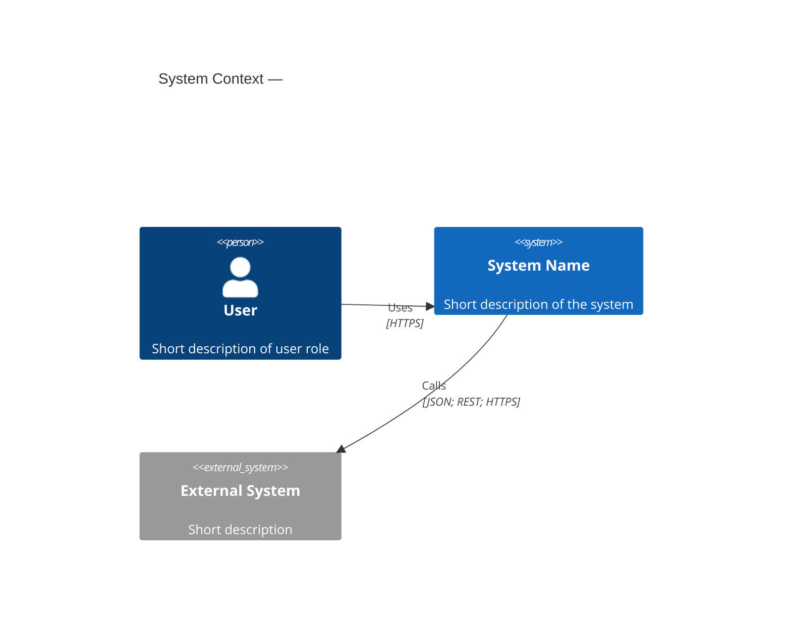
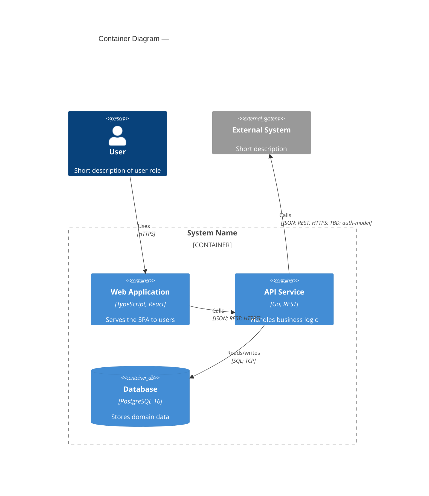

# C4 diagrams — справочник и шаблоны

Официальные источники: [C4 model](https://c4model.com/), [Diagrams (C4)](https://c4model.com/diagrams), [Abstractions](https://c4model.com/abstractions).

## Шаблон подписи Container

```text
API Gateway
[Container: Go, Envoy]
Маршрутизация и терминация TLS для внешних клиентов
```

Для хранилища:

```text
Orders DB
[Container: PostgreSQL 16]
Хранение заказов и статусов оплаты
```

## Шаблон подписи Software system

```text
Payment Gateway
[Software system]
Обработка платежей внешним провайдером
```

## Шаблон аннотации связи

Компактный вариант:

```text
JSON; REST; OAuth2 Bearer (JWT); HTTPS
```

Расширенный вариант:

```text
Request/response: JSON (OpenAPI 3.1)
REST; Auth: JWT (RS256); HTTPS / TLS 1.3
```

Для бинарных каналов:

```text
Protobuf; gRPC; mTLS; HTTP/2
```

## Палитра в стиле тёмной IDE

| Роль | Пример (hex) | Назначение |
|---|---|---|
| Фон диаграммы | `#1e1e1e` | Темный фон |
| Фигура/панель | `#252526` | Карточки контейнеров |
| Основной текст | `#cccccc` | Текст элементов |
| Акцент 1 | `#7c3aed` | Основные акценты |
| Акцент 2 | `#3b82f6` | Дополнительные акценты |
| Внешняя система | `#374151` | Отличие внешних систем |

## PlantUML C4

Для C4-PlantUML можно использовать форму `Container(alias, "Name", "Tech", "Description")`.

Рекомендация соответствия:

- Name -> строка 1 подписи;
- Tech -> строка 2 (`Container: <stack>` или стек по соглашению команды);
- Description -> строка 3.

Если инструмент не дает визуально собрать 3 строки в одной фигуре, добавляй note рядом с контейнером.

## Mermaid C4

Для Mermaid C4 (`C4Context`, `C4Container`, `C4Component`) заполняй поля так, чтобы читатель видел:

1. имя элемента;
2. `[Container: ...]` для контейнеров;
3. короткое описание роли.

## Dynamic C4 vs sequence

- C4 dynamic используется для архитектурной истории в терминах C4-элементов.
- Для строгой семантики UML последовательностей используй скилл `.agents/skills/skill.arch.ru.sequence-diagrams/SKILL.md`.

## Скелетные шаблоны

### PlantUML — C1 (System Context)

```plantuml
@startuml c1.system-name
!include https://raw.githubusercontent.com/plantuml-stdlib/C4-PlantUML/master/C4_Context.puml

title System Context — <System Name>

Person(user, "User", "Short description of user role")
System(system, "System Name", "Short description of the system")
System_Ext(extSystem, "External System", "Short description")

Rel(user, system, "Uses", "HTTPS")
Rel(system, extSystem, "Calls", "JSON; REST; HTTPS")

@enduml
```

### PlantUML — C2 (Container)

```plantuml
@startuml c2.system-name
!include https://raw.githubusercontent.com/plantuml-stdlib/C4-PlantUML/master/C4_Container.puml

title Container Diagram — <System Name>

Person(user, "User", "Short description of user role")

System_Boundary(sys, "System Name") {
    Container(webApp, "Web Application", "TypeScript, React", "Serves the SPA to users")
    Container(api, "API Service", "Go, REST", "Handles business logic")
    ContainerDb(db, "Database", "PostgreSQL 16", "Stores domain data")
}

System_Ext(extSystem, "External System", "Short description")

Rel(user, webApp, "Uses", "HTTPS")
Rel(webApp, api, "Calls", "JSON; REST; HTTPS")
Rel(api, db, "Reads/writes", "SQL; TCP")
Rel(api, extSystem, "Calls", "JSON; REST; HTTPS; TBD: auth-model")

@enduml
```

### Mermaid — C1 (System Context)



### Mermaid — C2 (Container)


