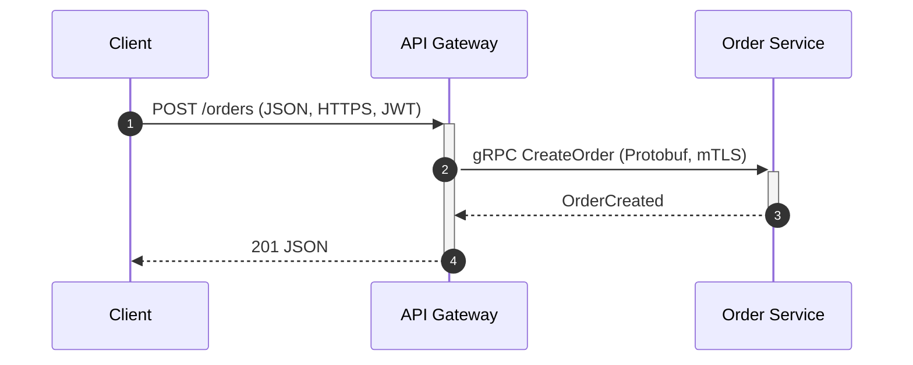

# Sequence and process diagrams — справочник и шаблоны

Официальные источники: [UML](https://www.omg.org/spec/UML/), [Sequence diagram](https://en.wikipedia.org/wiki/Sequence_diagram).

## Выбор process-диаграммы

| Контекст | Тип |
|---|---|
| Технический runtime-поток, интеграционный exchange | `sd.<diagram-title>.<ext>` |
| Бизнес-процесс и регламентные шаги | `bpmn.<title>.<ext>` |
| Saga/orchestration, переходы состояния | `wf.<title>.<ext>` |

Если остаются сомнения между форматами, согласуй выбор с пользователем до генерации.

## Мини-пример sequence (Mermaid)

Для более строгого UML добавляй `alt`/`opt`/`loop` и `Note over`.

## PlantUML sequence — напоминание

- `->` синхронный вызов;
- `->>` асинхронный;
- `-->` ответ;
- используйте `alt`/`opt`/`loop`/`par` для ветвлений и параллелизма.

## Ограничения Mermaid

Если Mermaid не покрывает требуемую UML-семантику, явно укажи ограничение инструмента и зафиксируй недостающее поведение в сопровождающем тексте.
