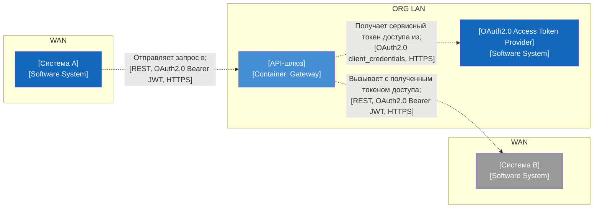

# Reference: требования к C2 (контейнерная диаграмма) межсервисной интеграции

C2 формируется **для людей по запросу** на основе тех-таблицы связей (`general-description`). Источник истины — таблица; диаграмма — производная. Формат по умолчанию — **mermaid** (по запросу — Structurizr DSL / PlantUML). Опирайся на рекомендации c4model.com ([https://c4model.com/](https://c4model.com/)).

## Элементы (узлы)

| Тип узла                   | Как изображать                                           | Лейбл внутри                                                                |
| -------------------------- | -------------------------------------------------------- | --------------------------------------------------------------------------- |
| Система (в периметре)      | Заполненный прямоугольник                                | **Имя** + `[Software System]` + (опц.) нумерованный список ответственностей |
| Внешняя система            | Серый прямоугольник (для облачной SaaS — силуэт облака)  | **Имя** + `[Software System]`                                               |
| Контейнер                  | Прямоугольник со скруглением внутри границы системы      | **Имя** + `[<технология>]` + (опц.) шаги обработки                          |
| Граница системы (boundary) | Пунктирный прямоугольник                                 | **Имя** + `[Software System]`                                               |
| Deployment node            | Внешний прямоугольник со скруглением                     | **Имя** + `[Deployment node: <tech>]`                                       |
| Зона-сеть (контур)         | Большой пунктирный прямоугольник, лейбл UPPERCASE в углу | напр. `WAN` / `<ORG> LAN`                                                   |
| Актор                      | (обычно отсутствует на C2 межсервисной интеграции)       | —                                                                           |

## Связи (стрелки)

- Стрелка — **направленная**, остриё у получателя; направление = «использует/вызывает», **не** «передаёт данные».
- Если важны оба направления (запрос и ответ) — рисуй **две** стрелки.
- Лейбл стрелки — **двухчастный**:
  1. **Строка 1 (семантика):** глагольная фраза по-русски, заканчивается `;` — напр. `Получает токен доступа из;`, `Перенаправляет запросы в;`.
  2. **Строка 2 (тех-кортеж в скобках):** `[<стиль взаимодействия>, <auth-модель>, <протокол/транспорт>]` + опц. формат данных / IP-фильтрация / «требуется трансформация».

Примеры тех-кортежа:

- `[OAuth2.0 client_credentials, HTTPS]`
- `[REST, API key, HTTPS]`
- `[PUSH, Basic Auth, HTTPS]`
- `[JSON, REST, OAuth2.0 Bearer JWT, HTTPS]`
- `[XML OData] (требуется трансформация запроса/ответа)`

## Layout

- Слева направо по пути запроса: источник (WAN) → интеграционный слой (LAN) → целевая система (WAN).
- Интеграционный слой (шлюз) — вложенный стек: deployment node → граница системы (пунктир) → контейнеры (Ingress, Gateway).
- Отдельный узел OAuth2.0 Access Token Provider — со стрелкой «получает токен доступа из».

## Правила воспроизведения из тех-таблицы

| Колонка тех-таблицы                      | Куда попадает на C2                    |
| ---------------------------------------- | -------------------------------------- |
| Источник / Приёмник                      | Узлы + направление стрелки             |
| Тип взаимодействия                       | 1-й слот тех-кортежа (REST/gRPC/OData) |
| Модель аутентификации                    | 2-й слот тех-кортежа                   |
| Протокол/транспорт                       | 3-й слот тех-кортежа                   |
| Формат данных                            | доп. слот / примечание                 |
| Направление (sync/async, PULL/PUSH/POLL) | семантика стрелки + слот стиля         |

## Mermaid-пример C2 (по тех-таблице)

Логика потока: A отправляет запрос на шлюз → шлюз получает сервисный токен у OAuth2.0 Access Token Provider → шлюз вызывает целевую систему B, предъявляя этот токен. В минимальном примере шлюз и провайдер показаны соседними узлами внутри ORG LAN, чтобы стрелка получения токена явно указывала на узел провайдера (а не на границу зоны); в полной схеме шлюз-контейнер вкладывается в границу системы и deployment node (см. раздел «Элементы»).

> Акторы (пользователи) на C2, как правило, опускаются — значимы системы и контейнеры. Пунктирные стрелки соответствуют конвенции корпуса C2. Заменяй плейсхолдеры `[…]` на реальные имена только в рабочем экземпляре (DLP).

