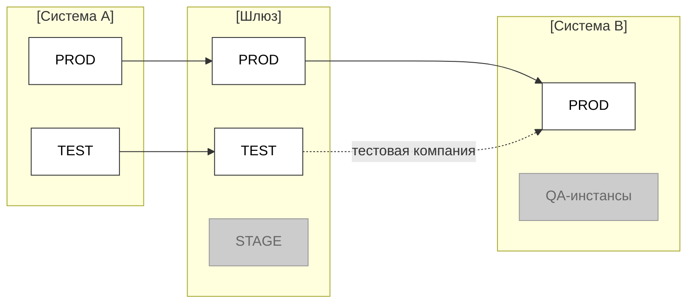

# Reference: требования к диаграмме взаимодействия окружений

Диаграмма окружений формируется **для людей по запросу** на основе `template.environments` (Таблица 2). Источник истины — таблицы. Формат по умолчанию — **mermaid**.

## Конвенции (из корпуса env-links)

| Элемент | Правило |
|---|---|
| Системы | Колонки слева направо в порядке цепочки вызова; заголовок колонки = имя системы |
| Окружения | Строки боксов внутри колонки; UPPERCASE-имя (TEST/STAGE/PRE-PROD/PROD/DEV или коды) |
| Выравнивание | Один тир — на одной горизонтали по всем колонкам |
| Активное окружение | Белая заливка, тёмная рамка (участвует в связи) |
| Неактивное/placeholder | Серая заливка, серая рамка (существует, но не в этой интеграции) |
| Совпадающий тир | Сплошная горизонтальная стрелка A.TIER → B.TIER → C.TIER |
| Несовпадающий маппинг | Изогнутая (bezier) стрелка между строками; допускается many:1 коллапс; короткая подпись на дуге (напр. «тестовая компания») |
| Подгруппа инстансов | Пунктирный прямоугольник вокруг параллельных боксов (напр. `QAS 200` + `QAS 300`) |
| Репликация тиров | Пунктирная обёртка + сноска «Идентичная схема взаимодействия окружений» вместо перерисовки каждого тира |
| Лейблы протоколов | Только над верхней routing-строкой (напр. `XML OData`, `JSON REST`, «требуется трансформация») |

## Правила воспроизведения из таблицы

| Колонка Таблицы 2 | На диаграмме |
|---|---|
| Окружение-источник / приёмник | Боксы в соответствующих колонках + стрелка |
| Тип маппинга `1:1` | Сплошная горизонтальная стрелка |
| Тип маппинга `many:1` | Изогнутые стрелки, сходящиеся в один бокс |
| Тип маппинга `диагональ` | Изогнутая стрелка между разными тирами |
| Примечание | Подпись на дуге |
| `Активно? = нет` (Таблица 1) | Серый бокс без стрелок |

## Mermaid-пример (по Таблице 2)

> Белые боксы — активные окружения, серые — неактивные/placeholder. Изогнутая стрелка с подписью — many:1 маппинг. Плейсхолдеры заменяй только в рабочем экземпляре (DLP).

## Воспроизведение при других конфигурациях

Чтобы построить схему для иной конфигурации, действуй строго по Таблице 2 и правилам выше — этого достаточно без знания исходного примера:

| Конфигурация | Как строить |
|---|---|
| Больше двух систем в цепочке | Добавь колонку (`subgraph`) на каждую систему в порядке вызова слева направо; связи — между соседними колонками |
| Число окружений не совпадает | Совпадающие тиры — `1:1` сплошной стрелкой; несовпадающие — `many:1`/`диагональ` изогнутой стрелкой с подписью-пояснением |
| Несколько инстансов в одном тире | Вынеси их в общий пунктирный `subgraph`-подгруппу внутри колонки системы |
| Окружение есть, но не участвует | Класс `off` (серый бокс), без стрелок |
| Тиры повторяют одну схему | Нарисуй один тир и добавь сноску «Идентичная схема взаимодействия окружений» вместо дублирования |

> Источник истины — Таблица 2 (`environments`). Любая схема выводится из неё детерминированно; пример выше — лишь иллюстрация конвенций.
