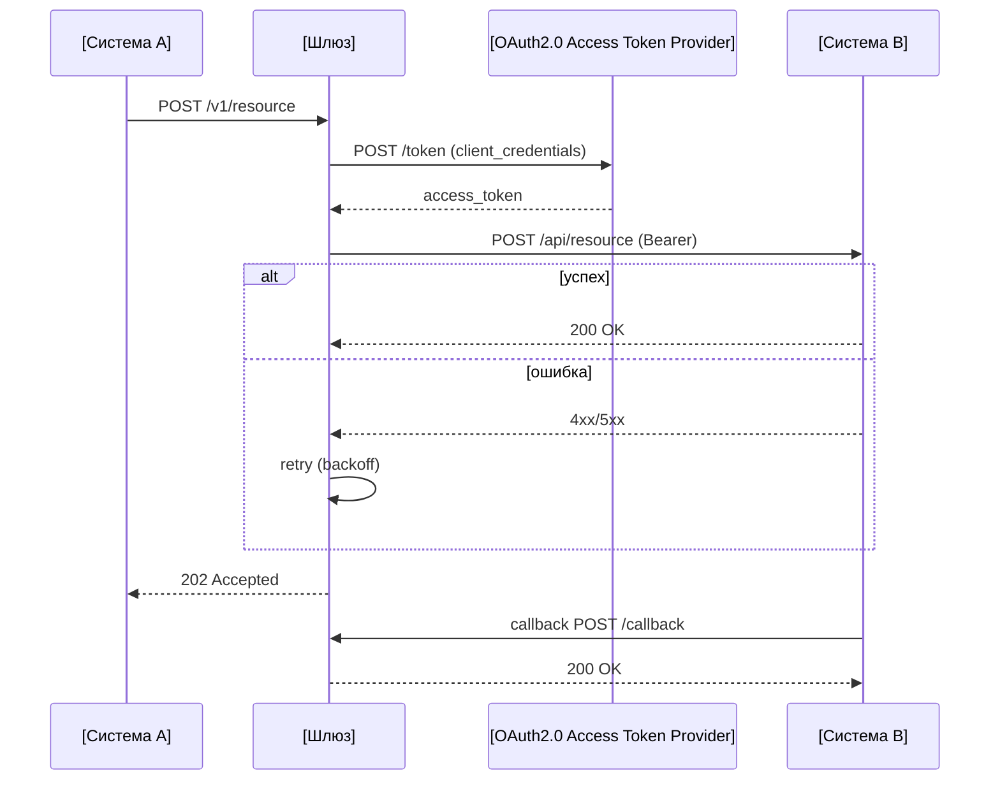

# Reference: описание алгоритма и sequence-диаграмма для сложных процессов

Для сложных интеграционных процессов (несколько вызовов, асинхронная обработка, оркестрация нескольких систем) опиши алгоритм **таблицей шагов** (источник истины для агентов), затем по запросу сформируй **sequence-диаграмму** для людей (mermaid по умолчанию).

## Таблица шагов (машинно-читаемый источник)

| Шаг | Актор (инициатор) | Целевая система | Вызов (метод/операция/событие) | Описание запроса | Описание ответа | Примечание |
|---|---|---|---|---|---|---|
| 1 | [Система A] | [Шлюз] | `POST /v1/resource` | передаёт ресурс на обработку | `202 Accepted` — принято в обработку | синхронный запрос |
| 2 | [Шлюз] | [OAuth2.0 Access Token Provider] | `POST /token` (client_credentials) | получает сервисный токен доступа | `access_token` | OAuth2.0 client_credentials |
| 3 | [Шлюз] | [Система B] | `POST /api/resource` (Bearer) | создаёт ресурс в целевой системе | `200 OK` — ресурс создан | трансформация запроса на шлюзе |
| 4 | [Система B] | [Шлюз] | callback `POST /callback` | уведомляет о завершении обработки | `200 OK` — подтверждение приёма | асинхронный ответ |

### Описание колонок
- **Шаг** — порядковый номер.
- **Актор (инициатор)** — кто инициирует сообщение.
- **Целевая система** — кого вызывает (получатель сообщения).
- **Вызов (метод/операция/событие)** — HTTP-метод/путь, имя операции, gRPC-метод или событие.
- **Описание запроса** — для чего выполняется вызов (бизнес-смысл).
- **Описание ответа** — что возвращается (статус/результат и его смысл).
- **Примечание** — дополнительная информация: `синхронный`/`асинхронный`, трансформация, условия, идемпотентность.

## UML-фрагменты (для ветвлений и циклов)

| Фрагмент | Когда |
|---|---|
| `alt` | взаимоисключающие ветви (успех/ошибка) |
| `opt` | опциональный шаг |
| `loop` | повтор (retry, постраничная выборка) |
| `par` | параллельные вызовы |

## Mermaid-пример sequence (по таблице шагов)

> Формат участников/фрагментов соответствует `skill.arch.ru.sequence-diagrams` (нейминг файлов `sd.<title>.<ext>`). Источник истины — таблица шагов; диаграмма — для людей. Плейсхолдеры заменяй только в рабочем экземпляре (DLP).
