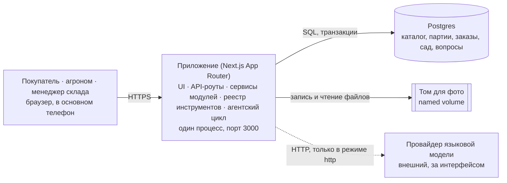

# Архитектура

Питомник растений. Документ отвечает на «как»; «что и зачем» — в `docs/spec.md`, выбор стека — в `memory/decisions/0001-stack.md`, модель данных как решение — в `memory/decisions/0002-data-model.md`.

Принцип: если правило можно нарушить, не заметив, — оно закреплено ограничением в БД или тестом, а не абзацем здесь.

---

## 1. Контейнеры



Одно приложение и одна база. Провайдер модели подключён пунктиром: он внешний и необязательный — в детерминированном режиме приложение работает без него полностью. Том для фото отдельный, потому что содержимое переживает пересборку образа.

---

## 2. Модель данных

Общие для всех модулей:

| Таблица | Ключевые колонки | Связи и ограничения |
|---|---|---|
| `users` | `id`, `name`, `role` | `role` — enum `customer / agronomist / warehouse`. Четыре демо-аккаунта из сида |
| `notifications` | `id`, `user_id`, `kind`, `payload`, `read_at` | FK → `users`. 🔶 Только переходы статуса заказа, запись — в транзакции перехода. Напоминания об уходе сюда не пишутся |

### catalog

| Таблица | Ключевые колонки | Связи и ограничения |
|---|---|---|
| `plants` | `id`, `name_ru`, `name_lat`, `light`, `min_zone`, `planting_season`, `care_level`, `soil`, `price_cents`, `photo_url`, `is_active` | `light` enum `sun / partial / shade`; `planting_season` enum `spring / autumn / spring_autumn`; `care_level` enum `low / medium / high`; `check (min_zone between 2 and 6)`; `check (price_cents > 0)` |
| `care_rules` | `id`, `plant_id`, `type`, `period_days`, `season_only` | FK → `plants`; `type` enum `watering / feeding / pruning`; `check (period_days > 0)`; `unique (plant_id, type)` |

### warehouse

| Таблица | Ключевые колонки | Связи и ограничения |
|---|---|---|
| `batches` | `id`, `plant_id`, `received_at`, `quantity`, `remaining`, `supplier` | FK → `plants`; **`check (remaining >= 0)`**; `check (remaining <= quantity)`; индекс `(plant_id, received_at, id)` — под выборку старейшей |
| `write_offs` | `id`, `batch_id`, `quantity`, `reason`, `actor_id`, `created_at` | FK → `batches`, `users`; `check (quantity > 0)` |
| `demand_facts` | `id`, `plant_id`, `quantity`, `kind`, `occurred_at` | FK → `plants`; `kind` enum `sold / rejected_no_stock`. `sold` пишется в транзакции создания заказа; отмена заказа факт **не стирает** — спрос был. Источник данных для плана закупок |

### orders

| Таблица | Ключевые колонки | Связи и ограничения |
|---|---|---|
| `cart_items` | `id`, `customer_id`, `plant_id`, `quantity` | FK → `users`, `plants`; `unique (customer_id, plant_id)`; `check (quantity > 0)`. Черновик заказа, остаток не резервирует |
| `orders` | `id`, `customer_id`, `status`, `fulfillment`, `slot_id`, `total_cents`, `is_paid`, `idempotency_key`, `created_at` | FK → `users`, `delivery_slots`; `status` enum шести значений; `fulfillment` enum `pickup / delivery`; `unique (idempotency_key)` — защита от двойного клика; `check (fulfillment = 'delivery') = (slot_id is not null)` |
| `order_items` | `id`, `order_id`, `plant_id`, `quantity`, `price_cents` | FK → `orders`, `plants`; `check (quantity > 0)`; цена фиксируется на момент заказа |
| `order_reservations` | `id`, `order_id`, `batch_id`, `quantity` | FK → `orders`, `batches`; `unique (order_id, batch_id)`. Хранит, **из какой партии сколько взято** — иначе отмену некуда возвращать |
| `order_status_history` | `id`, `order_id`, `from_status`, `to_status`, `actor_role`, `at` | FK → `orders`. Дописывается на каждый переход, не редактируется |
| `delivery_slots` | `id`, `slot_date`, `interval`, `capacity`, `taken` | `unique (slot_date, interval)`; `check (taken <= capacity)`; `capacity` по умолчанию 5. 🔶 Строки на 7 дней вперёд дописываются при чтении слотов через `on conflict do nothing` — фонового процесса нет |

### garden

| Таблица | Ключевые колонки | Связи и ограничения |
|---|---|---|
| `garden_plants` | `id`, `customer_id`, `plant_id`, `quantity`, `acquired_at` | FK → `users`, `plants`; `unique (customer_id, plant_id)` — одна запись с количеством, а не N записей. 🔶 Повторная покупка — upsert количества; `acquired_at` остаётся датой первой покупки |
| `care_events` | `id`, `garden_plant_id`, `type`, `planned_on`, `is_done`, `done_on` | FK → `garden_plants`; **`unique (garden_plant_id, type, planned_on)`**; `check (is_done = (done_on is not null))`. Состояния «просрочено» в таблице нет |

### consult

| Таблица | Ключевые колонки | Связи и ограничения |
|---|---|---|
| `questions` | `id`, `customer_id`, `plant_id`, `status`, `created_at` | FK → `users`, `plants` (необязательная); `status` enum `new / in_progress / answered` |
| `messages` | `id`, `question_id`, `author_id`, `author_role`, `body`, `photo_path`, `created_at` | FK → `questions`, `users`. **Только то, что видит покупатель** |
| `answer_drafts` | `id`, `question_id`, `body`, `rationale`, `confidence`, `created_at`, `approved_at`, `approved_by` | FK → `questions`, `users`. Черновик агента; покупателю не выдаётся никогда |

### Партии: резерв и списание от старейшей

Обе операции идут в одной транзакции и берут строки партий под блокировку в порядке поступления:

```sql
select id, remaining
  from batches
 where plant_id = $1 and remaining > 0
 order by received_at asc, id asc
   for update;
```

Дальше сервис распределяет требуемое количество по партиям сверху вниз, обновляет `remaining` и пишет строки в `order_reservations`. Если суммы не хватило — транзакция откатывается целиком, заказ не создаётся, остаток не трогается.

В той же транзакции создаётся сам заказ с позициями, пишутся факты спроса `kind = 'sold'` и **очищается корзина**: строки `cart_items` покупателя удаляются вместе с успешным созданием заказа. При откате корзина остаётся нетронутой — покупателю есть куда вернуться.

Порядок `for update` по одному и тому же индексу для всех операций — то, что не даёт двум одновременным заказам взаимно заблокироваться. Списание со склада берёт партии тем же запросом.

**Отдельная деталь:** факт спроса `kind = 'rejected_no_stock'` пишется **после** отката, своей транзакцией — иначе он откатился бы вместе с неудавшимся заказом, и план закупок никогда не увидел бы неудовлетворённый спрос.

### Статусный граф заказа

Допустимые переходы описаны константой в `orders/service.ts`, а не в БД: граф зависит от `fulfillment`, и выразить это ограничением в схеме дороже, чем проверить в одном месте кода.

```
новый ──▶ в сборке ──┬──▶ готов к выдаче ──▶ выполнен      (fulfillment = pickup)
                     └──▶ передан в доставку ──▶ выполнен  (fulfillment = delivery)
любой из четырёх ──▶ отменён
выполнен, отменён ──▶ (нет переходов)
```

Каждый переход дописывает строку в `order_status_history`; переход в `отменён` в той же транзакции возвращает `quantity` в партии по строкам `order_reservations`.

---

## 3. Инварианты

**Держит БД** — нарушить нельзя даже в обход сервиса:

- Остаток партии не уходит в минус и не превышает исходное количество: `check (remaining >= 0)`, `check (remaining <= quantity)`.
- Одно событие ухода на «растение в саду × тип × дата»: `unique (garden_plant_id, type, planned_on)`.
- Слот не переполняется: `check (taken <= capacity)`, `unique (slot_date, interval)`.
- Один заказ на ключ идемпотентности: `unique (idempotency_key)`.
- Доставка без слота и самовывоз со слотом невозможны: `check` по паре колонок.
- Все ссылки целостны: внешние ключи на каждом отношении.

**Держит сервис** — то, что от схемы не выражается:

- Допустимые переходы статуса и ветка после сборки по способу получения.
- Резерв и списание от старейшей партии: порядок `for update` и распределение по партиям.
- Возврат резерва в исходные партии при отмене.
- Следующее событие ухода считается от **фактической** даты выполнения, а не от плановой.
- Запись факта спроса при отказе из-за остатка — отдельной транзакцией.
- Отказ агента вне его зоны и запрет создавать заказ без подтверждения.

**Держит UI** — не гарантия, а защита от лишних ошибок:

- Четыре состояния на каждом экране; «просрочено» показывается отдельной группой.
- Кнопка оформления блокируется на время запроса.
- Прошедшие даты и заполненные слоты недоступны для выбора.
- Количество ограничено диапазоном 1…остаток.
- Заглушки помечены на экране, где ими пользуются.

---

## 4. Контракт API

Все HTTP-роуты модулей обслуживает один диспетчер `src/app/api/[module]/[[...path]]/route.ts`: он находит модуль в реестре, передаёт запрос в его `routes.ts` и переводит результат-значение в HTTP-ответ. Отдельных файлов под модуль в `src/app/api` не появляется.

Соглашение по путям: `/api/<module>/<action>`, модуль — имя папки, действие — глагол или существительное в единственном числе.

🔶 Текущий пользователь приходит из cookie `demo_user_id`, которую ставит переключатель пользователя. Диспетчер читает её, находит пользователя и кладёт его вместе с ролью в `ctx`; проверку роли делает `routes.ts` модуля и возвращает 403, если действие не для этой роли. Настоящей аутентификации за этим нет — заглушка и точка расширения под корпоративный вход.

Единый формат ответа:

```json
{ "ok": true,  "data": { } }
{ "ok": false, "error": { "code": "no_stock", "message": "Осталось меньше, чем в заказе", "details": { } } }
```

`message` — по-русски, показывается пользователю как есть. `code` — машинный, по нему написаны тесты.

| Код | Когда |
|---|---|
| 200 | Успех |
| 400 | Невалидный ввод: количество вне диапазона, неизвестный фильтр, пустое обязательное поле |
| 403 | Действие чужой роли или чужой объект |
| 404 | Объект не найден или снят с продажи |
| 409 | Конфликт состояния: нет остатка, слот заполнен, недопустимый переход статуса, списание больше остатка |
| 500 | Непредвиденная ошибка; наружу уходит без деталей |

| Модуль | Эндпоинт | Назначение |
|---|---|---|
| catalog | `GET /api/catalog/plants` | Список с фильтрами `light`, `zone`, `season`, `care`; возвращает счётчик |
| catalog | `GET /api/catalog/plant` | Карточка растения с правилами ухода и наличием |
| orders | `GET /api/orders/cart` · `POST /api/orders/cart-item` | Чтение и изменение корзины; остаток не резервирует |
| orders | `GET /api/orders/slots` | Слоты на ближайшие дни с признаком заполненности. 🔶 Перед выдачей дописывает недостающие строки на 7 дней вперёд (`on conflict do nothing`) |
| orders | `POST /api/orders/create` | Создание заказа: резерв в транзакции, `idempotency_key` обязателен |
| orders | `POST /api/orders/cancel` | Отмена покупателем до сборки; возвращает резерв |
| orders | `GET /api/orders/list` · `GET /api/orders/order` | Список заказов и один заказ с историей переходов |
| garden | `GET /api/garden/plants` · `GET /api/garden/events` | Сад и календарь: ближайшие, просроченные, выполненные |
| garden | `POST /api/garden/complete-event` | Отметка выполнения; планирует следующее событие |
| consult | `POST /api/consult/question` · `POST /api/consult/message` | Вопрос с фото и сообщение в тред |
| consult | `GET /api/consult/queue` · `GET /api/consult/thread` | Очередь агронома и лента переписки |
| consult | `POST /api/consult/draft` | Черновик диагноза; виден только агроному |
| consult | `POST /api/consult/approve` | Одобрение: черновик превращается в сообщение покупателю |
| warehouse | `GET /api/warehouse/stock` | Остатки в разрезе партий |
| warehouse | `POST /api/warehouse/write-off` | Списание с причиной; от старейшей партии |
| warehouse | `GET /api/warehouse/orders` · `POST /api/warehouse/transition` | Очередь заказов и перевод статуса |
| warehouse | `GET /api/warehouse/purchase-plan` | План закупок по формуле из `docs/spec.md` §3.5 |

---

## 5. Реестр инструментов агента

Инструмент — описание плюс обработчик, который вызывает функцию из `service.ts` того же модуля. Своей логики поверх данных у инструмента нет.

```ts
type Tool = {
  name: string;                 // "catalog.search_plants" — префикс по модулю
  description: string;          // по-русски, для модели
  parameters: ZodSchema;        // схема аргументов, она же валидация
  audience: "buyer" | "agronomist";
  handler: (args, ctx) => Promise<Result<unknown>>;  // вызывает service.ts
};
```

Реестр `src/agent/registry.ts` импортирует `tools.ts` каждого модуля и складывает инструменты в плоскую карту по имени. Совпадение имён — ошибка на старте приложения, а не тихая перезапись. Регистрировать инструмент вручную нигде не нужно: он появляется в реестре вместе с модулем.

В агентский цикл уходит не весь реестр, а срез по роли: `registry.forAudience(role)`. Покупатель не видит инструментов агронома и наоборот — это же и есть проверка прав на уровне агента.

Каждый вызов инструмента пишется в трассу шага: имя, аргументы после валидации, краткий итог (сколько нашлось, что изменилось). Трасса возвращается в интерфейс вместе с ответом и рисуется карточкой «что сделал и почему»: разобранные условия запроса сверху, вызовы инструментов списком, результат снизу. Ничего из того, что показывает карточка, не собирается отдельно — это та же трасса, которая была у цикла.

---

## 6. Провайдер языковой модели

```ts
interface LlmProvider {
  name: "http" | "rules";
  plan(request: string): Promise<AgentPlan>;
}
```

Провайдер возвращает намерение — `AgentPlan`: подбор с фильтрами, сводку самовывоза или отказ. Инструменты он не вызывает; их вызывает исполнитель `src/agent/runner.ts` через реестр и ворота подтверждения. Цикл написан руками, без SDK — [ADR 0003](../memory/decisions/0003-agent-loop-and-http-provider.md).

Две реализации, выбор — переменной окружения `LLM_PROVIDER`:

- **`http`** — внешняя модель через корпоративный gateway формата OpenAI chat completions. Адрес, ключ и имя модели приходят из окружения. Системный промпт собирается из реестра инструментов, ответ проходит zod-схему `AgentPlan`. Нет переменных, сеть, таймаут 15 с, ответ не по схеме — отказ с причиной, не откат на `rules`.
- **`rules`** — детерминированная. Разбирает запрос словарём маркеров: «тень» → `light=shade`, «зона 4» → `zone=4`, «без ухода по будням» → `care=low`, «глина» → тип почвы. Из разобранных условий собирает намерение и вызывает тот же инструмент из реестра. Ответ формулирует шаблоном.

Обе реализации проходят один и тот же набор тестов инструментов. Активный режим виден в интерфейсе бейджем рядом с агентом: в детерминированном режиме честно написано, что подбор идёт по правилам, а не моделью.

---

## 7. Точки human review

| Точка | Где закреплена в данных | Где закреплена в коде |
|---|---|---|
| Подтверждение заказа покупателем | Заказ существует только после `POST /api/orders/create`; корзина заказом не является | Инструмент создания заказа доступен агенту только при явной команде; по умолчанию агент доводит до корзины, а подтверждение сводки открывает экран оформления |
| Одобрение ответа агрономом | `answer_drafts.approved_at is null` — черновик; покупателю выдаются только `messages` | `POST /api/consult/approve` — единственный путь, создающий сообщение из черновика; проставляет `approved_at` и `approved_by` |
| Смена схемы данных или контракта API | Миграции в репозитории | Правило в `AGENTS.md`: агент останавливается и спрашивает |

Ни один эндпоинт не превращает черновик в сообщение автоматически, и ни один фоновый процесс не создаёт заказ: фоновых процессов в продукте нет вообще.

🔶 Отсутствие фоновых процессов держится тремя решениями: события ухода материализуются в момент действия; «просрочено» и индикатор напоминаний в шапке вычисляются при чтении — это события с `planned_on <= today` и `is_done = false`; строки слотов доставки дописываются при чтении слотов. По расписанию не пересчитывается ничего.

---

## 8. Тест-стратегия

**Unit** — чистая логика без БД:

- Распределение количества по партиям от старейшей, включая случай нехватки.
- Граф переходов статуса: разрешённые и запрещённые пары, ветка по способу получения.
- Планирование следующего события ухода от фактической даты.
- Детерминированный провайдер: фраза → разобранные условия → намерение.
- Перевод результата-значения в код ответа.

**Integration** — эндпоинты против настоящего Postgres:

- Гонка за последний экземпляр: две параллельные транзакции, ровно один заказ, остаток не отрицательный.
- Повторный `create` с тем же `idempotency_key` не создаёт второй заказ.
- Заполнение слота до вместимости и отказ следующему.
- Отмена возвращает количество в те же партии.
- Списание больше остатка отклоняется.
- `approve` создаёт сообщение, покупателю черновик не виден.
- Миграции применяются на чистой базе с нуля.

**Smoke на стенде, руками** — по критериям приёмки из `docs/spec.md` §11: главный сценарий с телефона, агент покупателя с подтверждением, отказ вне зоны, черновик и одобрение агронома, списание сверх остатка. Результат — запись в `JOURNAL.md`.

**Не тестируем и почему:** попиксельную вёрстку — глазами дешевле; живой ответ внешней модели — он вне нашего контроля; http-провайдер тестируется с замоканным `fetch` (разбор ответа, отказы по сети, таймауту и схеме), а в интеграционных тестах работает детерминированный; заглушки оплаты и уведомлений — тестировать нечего; доступность и контраст — проверяются по чек-листу вручную.

---

## 9. Деплой

Один `docker-compose.yml` в корне: сервис приложения и Postgres.

- Приложение слушает `3000` без привязки к хосту, отдаёт `/health`.
- Healthcheck — запрос на `127.0.0.1`, не на `localhost`.
- Тома именованные: данные Postgres и загруженные фото.
- На старте приложения: применение миграций, затем сид демо-данных, если база пустая.
- Секретов в репозитории нет; в нём лежит `.env.example` — список имён без значений.

Переменные окружения:

| Имя | Назначение |
|---|---|
| `DATABASE_URL` | Подключение к Postgres |
| `LLM_PROVIDER` | `http` или `rules` |
| `LLM_BASE_URL`, `LLM_API_KEY`, `LLM_MODEL` | Параметры внешней модели; не нужны в режиме `rules` |
| `UPLOAD_DIR` | Каталог фото на томе |
| `APP_TIMEZONE` | Единый часовой пояс продукта |
| `SEED_ON_START` | Наливать ли демо-данные |
